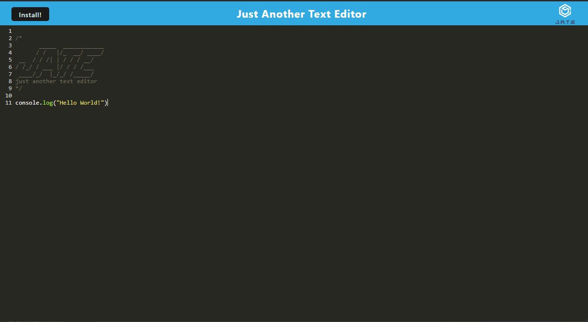

# PWA Text Editor

## Description
  
There are various means of optimizing content distribution delivered to the client side. In order to learn a common technique of allowing information to be updated to for the client in an efficient manner, I have set out to create a simple text editor that uses progressive web applications. Now a user can view a web application that was made for the browser offline on their own computer using the tools provided by PWA's and workbox. I learned how to use a service worker, different caching methods, and how a manifest can be used to create a web application that can be used offline.

- [Installation](#installation)
- [Usage](#usage)
- [Contribute](#contribute)
- [Tests](#tests)
- [Links](#links)
- [Questions](#questions)

## Installation
  
Clone this repository and run npm i at the command line.

## Usage
  
Run npm run start and navigate to the web application. The most recent notes taken will be automatically saved whenever you click outside of the web application window. If you wish to use this web app offline then click the install button.

## Contribute
  
No contributions necessary, but any input on how to improve my code is appreciated.

## Tests
  
No tests written at this time.

## Links

https://damp-peak-19637-7250a967b51c.herokuapp.com/

## Questions

Username: DanielTBonn
Github: https://github.com/DanielTBonn/
Email: danieltbonn@gmail.com